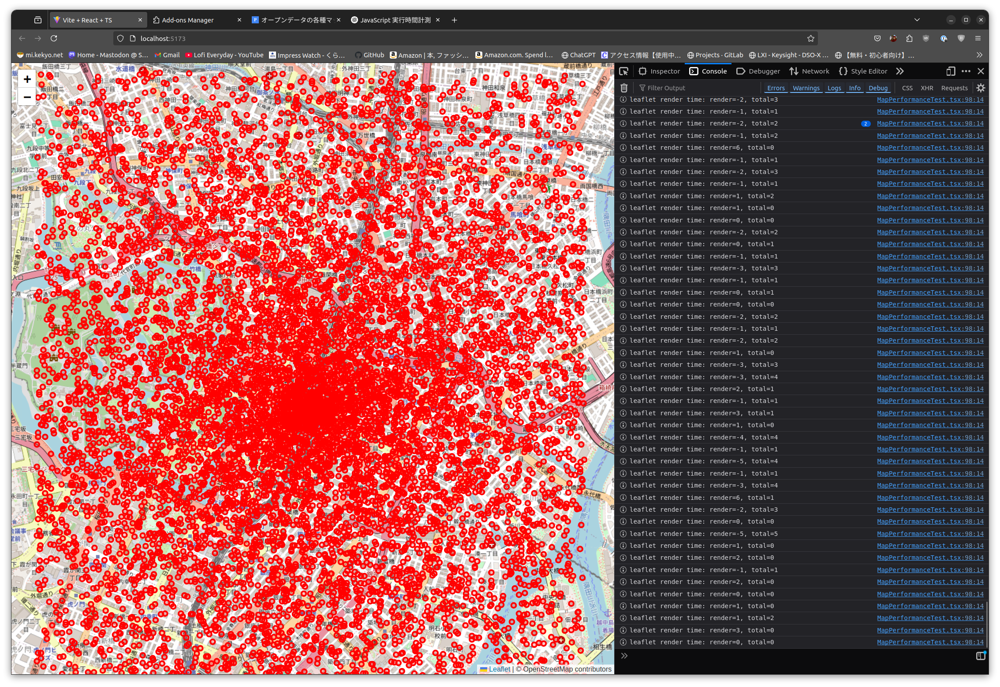
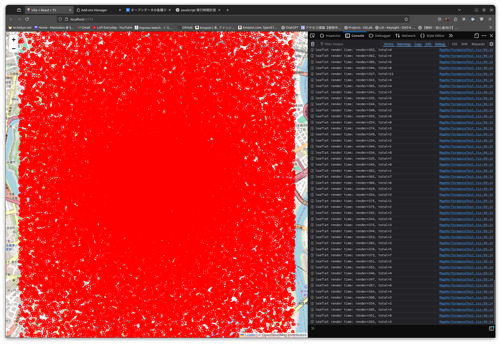
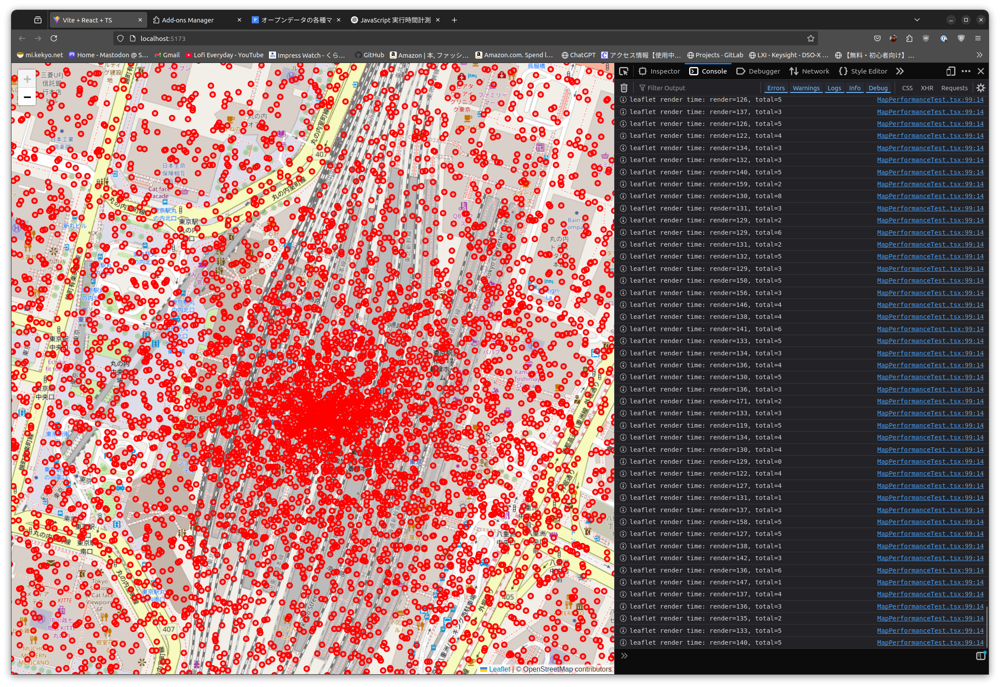
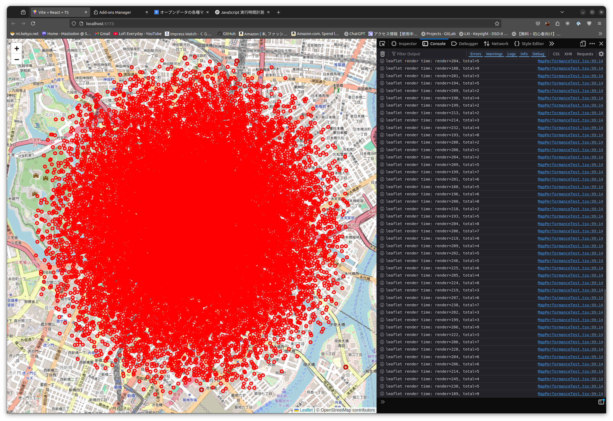
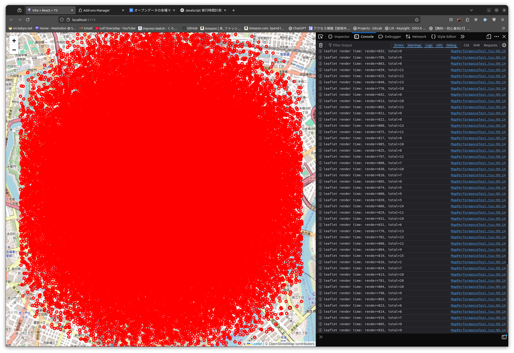
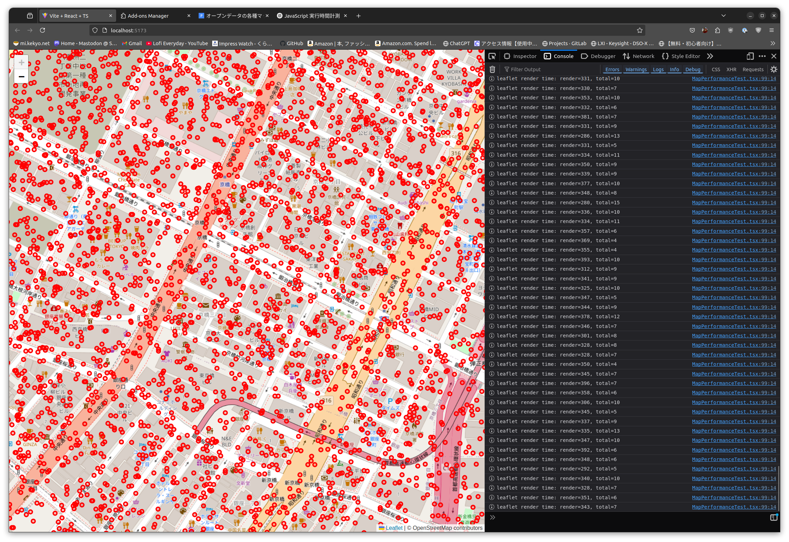
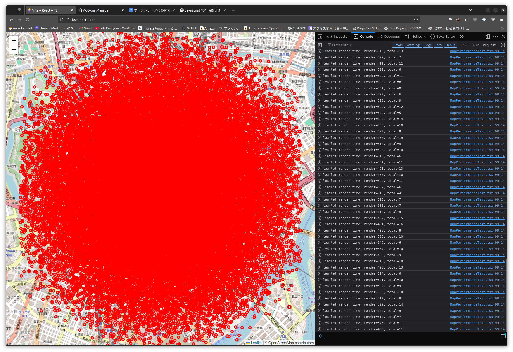

# MapLibraとleafletのパフォーマンス比較

結論:

* 両方ともJavaScriptとは思えないほど速いが、ポイント数が非常識なほど多いと相応に遅くなる。
  したがって、多ポイント数を扱う場合は、アーキテクチャ上の軽減設計が必要になる。
  （例えば、ズームに応じて実際に表示するポイント数を減らしたり、更新頻度を遅くするなど。 [FlightRader24](https://www.flightradar24.com/) が参考になると思う）
* MapLibraはWebGL対応で、多ポイント数でもJavaScriptの実行負荷が軽い（画面描画がJavaScriptに影響しにくい）。
* MapLibraはベクターデータに対応。現在は出来るかどうかわからないが、Z軸座標を供給して高低差を3D表示するなどの展望がありえる。また、ラスタータイルを使うこともできるので、2D-->3Dへの段階的な移行が可能。しかしleafletはラスタータイルのみ対応。
* MapLibraは積極的にメンテナンスされている。
* 新規に開発するなら、MapLibraが良いと思う。

# leaflet test

* Intel Core i9-12900KS / GeForce RTX 3090 / Ubuntu 22.04LTS / Firefox 137.0.2 (64-bit)
* 計算時間は大体1ms/10000pointsを超えるぐらいなので、100000pointsでもそれほど負荷に影響はない。

## 10000points

* `UPDATE_INTERVAL=100`, `RENDER_MOD=1`: 問題ない。レンダリング遅延なし。計算時間は<=1ms
  

## 50000points

* `UPDATE_INTERVAL=100`, `RENDER_MOD=1`: 遅くなった。レンダリングは350msぐらい。計算時間は≈7ms
  
* `UPDATE_INTERVAL=100`, `RENDER_MOD=1`: 拡大すると多少速くなる。レンダリングは160msぐらい。計算時間は≈7ms
  
* `UPDATE_INTERVAL=100`, `RENDER_MOD=2`: 間引きすると多少速くなる。レンダリングは200msぐらい。計算時間は≈7ms
  

## 100000points

* `UPDATE_INTERVAL=100`, `RENDER_MOD=1`: 遅い。レンダリングは850msぐらい。計算時間は≈13ms
  
* `UPDATE_INTERVAL=100`, `RENDER_MOD=1`: 拡大すると多少速くなる。レンダリングは380msぐらい。計算時間は≈13ms
  
* `UPDATE_INTERVAL=100`, `RENDER_MOD=2`: 間引きすると多少速くなる。レンダリングは500msぐらい。計算時間は≈13ms
  

# MapLibra

* MapLibraならWebGLが使用されベクトルデータ描画が可能なので、結果が大きく違うのではないかと考え、MapLibraで軽くテストも行った
  （MapLibraはleafletのようにラスタータイル地図でも表示出来るが未評価）。
* 非常に興味深い。点数が10000でも50000でも100000でも、JavaScript上のパフォーマンスに違いが殆どなく（計算時間だけ比例して増加するのはleafletと同じ）、かなり安定してインターバルの遅延もなく実行できている。
* しかし、実際の描画は点数が多いほどFPSが低下しているように見える。10000ならそこそこスムーズだが、100000ともなるとかなりFPSが落ちている。JavaScript側に全く影響しないため、描画処理が完全にGPUにオフロードされている感触がある。
* FireFoxでは問題なかったが、Chromeでは100000を動かしていると、途中でメモリ不足例外が発生した（JavaScript内で発生するだけで、ブラウザが落ちることはなかった）。

## 10000points

参考までに一つだけ保存する（環境も異なるので注意: i9-9980XE/GeForce RTX 4060 Ti 16GB）:

* `UPDATE_INTERVAL=100`, `RENDER_MOD=1`:
  

# License

CC0
